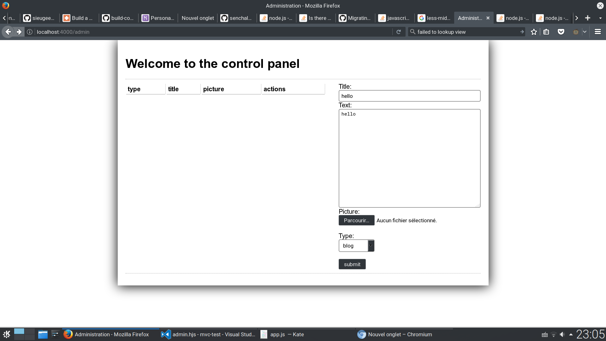

# mvc-test
Technology Workshop assignment: https://code.tutsplus.com/tutorials/build-a-complete-mvc-website-with-expressjs--net-34168.
This website is partially complete - only the home and admin pages are available.

# Deployment
First, go into the cloned directory and install the dependencies: `npm install`.

Run the app: `npm start`

For example, here is a screenshot of the admin page.

